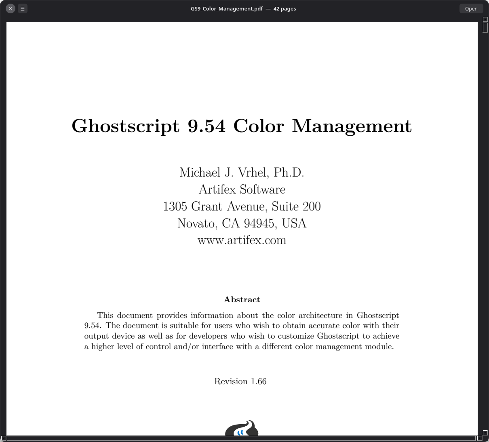
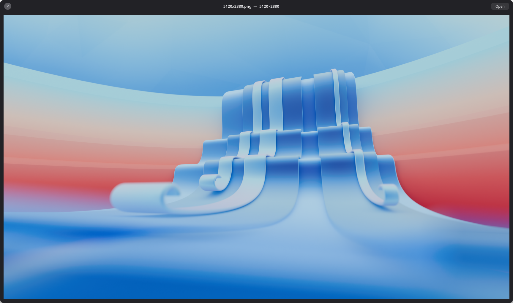
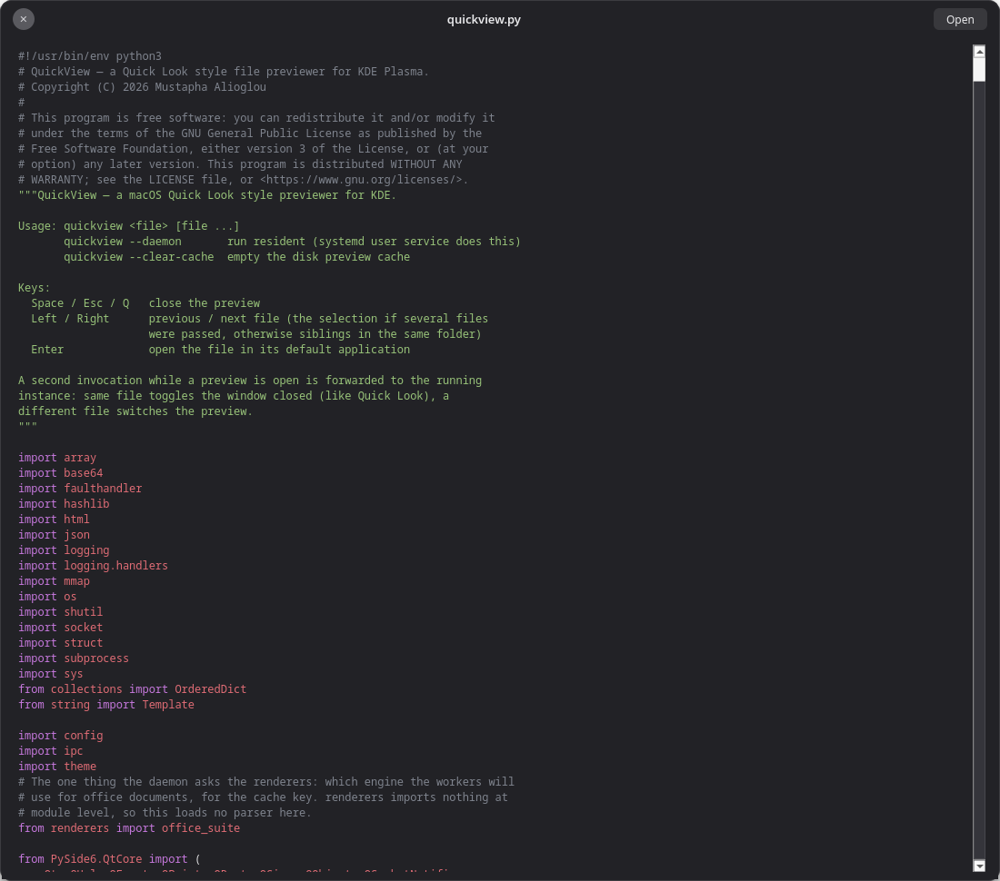

# QuickView for KDE Plasma 6

A macOS **Quick Look**–style file previewer for KDE Plasma. Select a file in
Dolphin, press **Space**, and a floating dark preview panel appears. Press
Space again (or Esc) to dismiss it.



<p align="center">
  
  
</p>

Multi-select works too: select **several files**, trigger QuickView, and
**← / →** pages through them — the title shows your position (e.g. `2/5`),
just like Quick Look on a multi-file selection.

## Features

- **Instant.** A resident daemon keeps Qt loaded, so the panel appears in
  ~20 ms instead of the ~1 s a cold start costs. The launcher hands the path
  over in about 4 ms through a compiled client that loads no interpreter.
- **Every parser runs in a sandbox.** Images, PDFs, animations, audio,
  video, archives, office documents and the syntax highlighter all decode
  inside a bubblewrap jail with no network and no filesystem — the file
  arrives as a file descriptor. HTML is the exception only in that it uses
  Chromium's own renderer sandbox instead. The daemon holds the window, the
  socket and the cache, and no decoder at all.
- **← / →** walks the folder, or pages through a multi-file selection.
- **Find in PDFs and books.** **Ctrl+F** searches the text and highlights
  matches in place; **Enter** / **Shift+Enter** step through them. Phrases
  work, including across line breaks.
- **Contents sidebar.** The **☰** button top left lists a PDF's bookmarks, a
  book's chapters or a Markdown file's headings — nested and with page
  numbers; clicking one jumps to that heading, not merely to the page it is
  on. The button only appears when the
  document actually has a table of contents.
- **EPUB books are read, not listed.** The spine is laid out as pages with
  each chapter starting on its own page, and the book's own table of
  contents becomes the sidebar. The page colours are a setting —
  `book_theme = gruvbox-dark` (or `gruvbox-light`, `sepia`, `dark`, the
  default `paper`).
- **Markdown renders**, with a titlebar button flipping between the
  rendered pages and the highlighted source, and its headings in the
  contents sidebar. It uses the page palette too, so
  `book_theme = gruvbox-dark` themes both books and Markdown.
- **Syntax highlighting** for source files, lexed by Pygments inside the
  jail and themeable with any Pygments style.
- **Archives are listed, never extracted**, so an archive that expands to
  terabytes costs nothing to look at.
- **Office documents are laid out as pages**, like a PDF, rather than shown
  as a wall of text.
- **Spreadsheets open as a real grid**, one tab per sheet, with the column
  letters and row numbers the file actually uses, dates and percentages
  formatted the way the workbook formats them, and numeric columns aligned
  right.
- **Media plays inline** with a seek bar, decoded and mixed in the jail.
- **HTML renders** with JavaScript off and the network blocked, and the
  titlebar flips to source view.
- **Two-tier preview cache**, in memory and on disk, so reopening a file is
  effectively instant; neighbouring images are warmed in the background
  while you look at the current one.
- **Anything it cannot preview** still gets a card with its icon, type, size
  and modified date, so Space is never a dead key.
- **Configurable** through `~/.config/quickview/quickview.conf`, written with
  its defaults commented in on first run.
- **Self-contained.** `install.sh` builds a virtualenv and touches no system
  packages. **Enter** opens the file in its real application whenever the
  preview is not enough.

## What it previews

| Type                | How                                        |
|---------------------|--------------------------------------------|
| Images (PNG, JPG, WebP, SVG, …) | Scaled to fit, shows dimensions |
| Photoshop (PSD, PSB) | The flattened composite, scaled to fit — no layer is parsed |
| Krita / OpenRaster (KRA, ORA) | The flattened composite stored in the file |
| Animated GIFs       | Played inline                              |
| PDFs                | Scrollable multi-page view, Ctrl+F, bookmarks sidebar |
| Illustrator (AI)    | Rendered as the PDF it is, in the same page view |
| EPUB books          | Laid out as pages, Ctrl+F, chapter sidebar with page numbers |
| HTML                | Rendered page (JS off, network blocked) — titlebar button flips to source view |
| Video / audio       | Plays inline with a seek bar               |
| Markdown            | Rendered pages with a headings sidebar — titlebar button flips to the highlighted source |
| Text / code / CSV   | Monospace view with syntax highlighting (first 1 MiB) |
| Archives (zip, rar, 7z, tar…) | Contents listing with sizes — nothing is extracted |
| Spreadsheets (xlsx, xlsm, ods) | A table per sheet, with tabs along the bottom |
| Office docs (docx, odt)  | Laid out as pages, like a PDF — headings, tables and images |
| Folders             | Item count and contents listing            |
| Everything else     | Icon, type, size and modified date         |

## Keys (while the preview is open)

| Key             | Action                                   |
|-----------------|-------------------------------------------|
| Space / Esc / Q | Close the preview                         |
| ← / →           | Previous / next file — pages through the selection if several files were passed, otherwise folder siblings |
| Enter           | Open the file in its default application  |
| Ctrl+F          | Find text in a PDF, words or phrases — Enter and Shift+Enter step through matches, Esc closes |
| Ctrl+Q          | Quit the background daemon entirely       |

## Syntax highlighting

Source files are coloured by [Pygments][pyg], which runs **inside the jail**
with everything else — its lexers are regexes, and a file written to make one
backtrack should take down a throwaway worker, not the daemon that owns your
window. What comes back is the text plus a list of colour spans; the daemon
paints ranges and parses nothing.

Files over 256 KiB are shown unhighlighted (lexing 1 MiB takes ~1.5 s, which
is slower than the preview it decorates). Any Pygments style works:

```ini
# ~/.config/quickview/quickview.conf
[preview]
code_style = dracula   # gruvbox-dark, nord, monokai, native, …
```

See [Settings](#settings) below. Without Pygments installed the preview is
plain text — nothing breaks.

[pyg]: https://pygments.org/

## Preview cache

Image decodes are cached in two tiers (the `quicklookd` model):

- **Memory** — recently shown pixmaps stay in the daemon; re-showing or
  paging back with ← → skips decoding entirely.
- **Disk** — `~/.cache/quickview/previews/` (PNG entries, capped at 256 MiB,
  pruned oldest-first). Keys embed the file's mtime + size, so a changed
  file re-renders automatically — no stale previews.

Clear it with `quickview --clear-cache`.

## Sandboxed rendering

**Every format QuickView decodes itself is parsed outside the daemon**,
inside a bubblewrap jail: still images, PDFs, animations, audio, video, and
the syntax highlighter. The daemon holds the window, the socket and the
cache — it does not hold a decoder. HTML is the one exception, and it is
covered under *What still runs in the daemon* below.

The jail has read-only `/usr`, this app folder and the font config, no
network (`--unshare-all`), no capabilities (`--cap-drop ALL`), no writes,
and — this is the part that matters — **no access to your files at all**.
The file arrives as a file descriptor passed over the worker socket, so
there is nothing to bind-mount and nothing for a compromised parser to go
looking for. A malformed file can only take down its own throwaway worker.

**It is also faster than parsing in-process was.** Entering the jail costs
about 3 ms; what used to cost ~150 ms per preview was importing Qt in a
fresh helper. So workers are booted *before* they are needed and parked on
a socket, and each one still handles exactly one file and then exits — the
same per-file isolation as a throwaway helper, with the startup paid by a
spare instead of by you. Measured on a 1-page PDF: 583 ms before, ~120 ms
now; a cached preview is ~2 ms.

- **Images** — decoded to a PNG that the daemon caches and displays.
- **Photoshop files** — Qt has no PSD handler, so this one format QuickView
  parses itself, in the jail with everything else and using nothing but the
  standard library. It reads the flattened composite Photoshop already stores
  alongside the layers and never touches a layer, so the expensive half of the
  format is the half a preview skips. The compressed image data carries a table
  of every scanline's length, which means rows can be *seeked past* rather than
  decoded: a 6000x4000 document shown in a 1600 px box decodes about a third of
  its rows and a third of each one: 95 ms against 281 ms for the same decode
  undecimated, and unlike the full decode the cost barely moves as the
  document grows, because what it tracks is the size of the preview.

  How busy the artwork is matters more than how big it is. A scanline of
  photographic noise codes as a few dozen long PackBits opcodes, but one of
  dithered or high-frequency two-colour artwork codes as thousands of short
  ones, and costs around 25x as much to walk in Python — the same 12
  megapixels take 95 ms in the first case and 733 ms in the second. Both are
  cached after the first look; the only way to close that gap would be a C
  extension, and this stays a project you install without a compiler.

  A file saved without "Maximize Compatibility" has no
  composite at all, and falls back to the JPEG thumbnail in its image
  resources. PSB, 16-bit, CMYK, greyscale and indexed files all decode; Lab and
  1-bit bitmaps fall back to the thumbnail.
- **Krita and OpenRaster files** — a `.kra` is a zip with the flattened image
  inside it as an ordinary PNG (`mergedimage.png`), which Krita writes so that
  thumbnailers never have to understand a layer stack. Reading that one member
  is the entire decoder, and it is handed back to the image path so it gets the
  scaled read and the dimensions like any other PNG. OpenRaster's specification
  requires the same member, so `.ora` comes along for free; `preview.png` is
  the fallback, and the member is bounded before and after it is read so a zip
  bomb is refused rather than decompressed.
- **Illustrator files** — an `.ai` has been a PDF since Illustrator 9, so one
  is handed to the PDF path above and streams, scrolls and caches identically.
  The daemon reads four bytes to check for `%PDF` before it does — a sniff, not
  a parse — and a PostScript-only `.ai` from before that still gets the
  metadata card.
- **PDFs** — pages stream one at a time, so page 1 appears while the rest
  (capped at 50) render; each page is cached individually.
- **Animations** (GIF/APNG) — every frame is decoded in the jail and
  streamed here; playback is a timer cycling pixmaps the daemon already
  holds, so no animation parser runs in this process.
- **Text and code** — read and lexed in the jail; what comes back is the
  text plus colour spans, so no lexer runs in this process.
- **Markdown** — Qt parses Markdown itself (md4c, behind
  `QTextDocument.setMarkdown`), so a rendered preview needs no library and
  no HTML engine. The parse happens in the jail like every other one and
  the daemon receives page images; the titlebar button flips to the
  highlighted source, and the page palette applies here too.

  The headings become the sidebar, nested by their hashes and carrying the
  page each one landed on — a Markdown file has no table of contents of its
  own, and its headings are the closest thing to one.

  Three things are done to the document before it is painted. Raw HTML tags
  are stripped outside code, because Qt hands an HTML block to its rich-text
  importer mid-parse and an unbalanced one — `<p align="center">` around two
  `` tags, the way half of GitHub's READMEs open — swallows the rest of
  the file: this project's own README imported as 2,420 of its 22,222
  characters, every later paragraph silently gone. And images are replaced
  by a note naming them, since a Markdown file's images sit next to it on
  disk and the jail has no disk — Qt would otherwise resolve those relative
  paths against the worker's working directory, which loads an image only
  when the document happens to live inside this application's own folder.
  Finally, fenced code is imported as unbreakable lines, which a page cannot
  scroll sideways to show, so it is allowed to wrap: a wrapped line reads
  slightly wrong, a line cut off at the margin reads as a bug.
- **Archives** — headers only, never an extraction, so an archive that
  expands to terabytes costs nothing. zip and tar are read by Python's
  standard library; rar, 7z and the rest by whichever of `bsdtar`, `7z` or
  `unrar` exists. Those read the archive through `/dev/fd`, so the jail
  still needs no path and no copy. Nothing to list (encrypted headers, a
  corrupt file, no lister installed) falls back to the metadata card.
- **Office documents** — laid out as page images in the jail and shown by
  the same page view PDFs use, so they scroll, cache and stream identically.
  They have no find: a document laid out through `QTextDocument` has no
  text layer, and unlike a book nothing here re-lays it out to search it.
  Word-processor documents (docx, odt) are converted to the HTML subset
  `QTextDocument` lays out — headings, bold and italic, tables, embedded
  images — which needs nothing but Qt and Python's standard library. Not
  pixel-identical to Word, but a page rather than a wall of text.

  Spreadsheets take a different route, because a workbook is a grid rather
  than a page: a `sheets` op reads the cells in the jail and the daemon
  shows them in a table with a tab per sheet, hidden sheets left out. Dates
  and percentages are numbers wearing a number format in xlsx, so the
  format codes are read too — otherwise every date shows up as a five-digit
  serial. Cells are placed by their own reference, so a sparse row keeps its
  columns. Each sheet is bounded (2000 rows, 64 columns, 512 characters a
  cell), so a million-row workbook costs what a small one does. Anything
  that will not parse as a grid — encrypted, corrupt, an unusual shape —
  falls back to the page view above.
- **EPUB books** — a book is a zip of XHTML with a reading order, which is
  close enough to what `QTextDocument` lays out that no reader engine is
  needed. The spine is converted to the same HTML subset the office path
  uses and inserted chunk by chunk through a cursor; the cursor's position
  at each chunk is what turns the book's table of contents into page
  numbers, and every spine document starts a new page, the way a chapter
  does in print. Both kinds of contents are read — the EPUB 3 navigation
  document and the EPUB 2 NCX — and a book with neither gets a chapter list
  built from each file's first heading. Books are full of HTML entities
  (`&nbsp;`, `&mdash;`) that no XML parser is required to know, so those are
  resolved before parsing; a chapter that still will not parse is skipped
  rather than taking the book down with it.

  **Ctrl+F works in a book** the same way it does in a PDF, but by a
  different route: there is no text layer to extract, so an `epubsearch`
  op lays the book out again — same width, same style sheet — and measures
  each match against that layout, line by line, into the page rectangles
  the daemon paints. Because it is the layout the pages were rendered
  from, a highlight lands exactly on its words; a match that wraps gets one
  rectangle per line, and one on a page past the render cap is dropped.

  A book is something a person reads for minutes rather than glances at, so
  the page has a palette: `book_theme` picks one of paper, sepia, dark,
  gruvbox-dark and gruvbox-light, and the worker paints the page background,
  body text, headings and quotations from it. Only the page is themed — the
  panel around it is application chrome. The theme name is part of the page
  cache key, so switching themes re-renders rather than serving back the
  pages of the old one.
- **The contents sidebar** — one sidebar for three kinds of document. A
  PDF's bookmarks come from a `pdfoutline` op that walks Qt's bookmark model
  in the jail and answers with `[{title, level, page}]`; a book's chapters
  and a Markdown file's headings come from the same layout pass that
  produced their pages, so they ride on the render's header. Either way the daemon receives a flat list with page
  numbers, caches it beside the page images (so a reopened document keeps
  its sidebar without a second parse — including when the answer is "this
  document has no headings", which is an answer worth not asking for twice),
  and shows it in one tree.

  Each entry carries where on its page it sits, not just which page. A page
  is routinely taller than the window — 2326 px against 1451 on a
  3072×1728 screen — so page-granular jumps make every section of one
  chapter scroll to the same place, which from the outside looks like the
  sidebar doing nothing. The offset comes from the bookmark's own
  destination for a PDF, and from the layout that produced the pages for a
  book or a Markdown file. Entries
  pointing past the last rendered page are dropped in the jail: a sidebar
  row that scrolls nowhere is worse than no row.

  Slide decks (`.pptx`, `.odp`) are not previewed: their content is
  absolutely positioned graphics that `QTextDocument` cannot lay out, and
  the only thing that can is a full office suite. Legacy binary `.doc`,
  `.xls` and `.ppt` are out for the same reason. Both show the metadata
  card.
- **Audio and video** — `media_worker.py` runs the whole pipeline in the
  jail and plays the audio itself through PipeWire (the one extra socket
  bound in). Because it owns the audio clock, Qt does A/V sync in there;
  video frames land in a shared memfd and the daemon just blits them.
  Play/pause/seek are messages, not method calls.

If `bwrap` is not installed, previews that need a parser fall back to the
metadata card (secure by default). Override at your own risk with
`QUICKVIEW_ALLOW_UNSANDBOXED=1` (out of process, but **not** sandboxed).

### What still runs in the daemon

Honest list — these are the reads that never reach a jail:

- **HTML** (`QtWebEngine`) — hardened rather than jailed by us: JavaScript
  and plugins disabled, every request outside `file:`/`data:` blocked (no
  phoning home), off-the-record profile. Untrusted markup is parsed in
  Chromium's own renderer process, which has its own sandbox; putting it in
  ours would be strictly worse. `QUICKVIEW_STRICT_SANDBOX=1` drops HTML to
  the plain source view if you would rather not rely on that.
- **Text** — only as a fallback. Text normally goes through the jail like
  everything else (that is where the highlighter runs); when the sandbox is
  unavailable the daemon reads the bytes itself, capped at 1 MiB, on a pool
  thread so a stalled network mount can't freeze the window. No parser is
  involved on that path — the file is shown uncoloured.
- **MIME sniffing** and the file-type icon — Qt reads magic bytes to decide
  which of the above applies. Bounded matching, no decoding.
- **The workers' own PNG output**, which the daemon decodes to display. A
  compromised worker could aim a malformed PNG at the daemon's decoder —
  one hardened format instead of every format Qt supports, but not zero.
  The same decoder runs on disk cache entries, and those live in
  `~/.cache/quickview/previews/` where anything running as you can rewrite
  them, so it is the same exposure by a second route.

## Logging & crash diagnostics

- `~/.local/share/quickview/quickview.log` — timestamped events (rotated
  past ~5 MiB); also echoed to stderr (the journal, under systemd):
  `journalctl --user -u quickview -e -f`
- `~/.local/share/quickview/crash.log` — faulthandler tracebacks if a
  native crash (e.g. inside a Qt decoder) takes the process down.

## Settings

`~/.config/quickview/quickview.conf`, written with the defaults commented in
the first time the daemon starts. Editing it takes effect on the next
restart:

```bash
systemctl --user restart quickview.service
```

| Setting | Default | What it does |
|---------|---------|--------------|
| `[preview] code_style` | `one-dark` | Pygments style for source files |
| `[preview] book_theme` | `paper` | Page colours for EPUB books and rendered Markdown: `paper`, `sepia`, `dark`, `gruvbox-dark`, `gruvbox-light` |
| `[preview] text_limit_kb` | `1024` | How much of a text file to read before truncating |
| `[preview] pdf_max_pages` | `50` | Pages rendered from a PDF or office document |
| `[cache] disk_cache_mb` | `256` | Rendered previews kept on disk; `0` disables it |
| `[cache] memory_cache_mb` | `96` | Decoded pixmaps kept in memory |

Each has a matching `QUICKVIEW_*` environment variable (`QUICKVIEW_CODE_STYLE`,
`QUICKVIEW_BOOK_THEME`, `QUICKVIEW_PDF_MAX_PAGES`, …) that wins over the file,
which is handy for trying a value without editing anything. Out-of-range
numbers are clamped, an unknown theme name reads as the default, and an
unreadable file falls back to the defaults — so a typo never stops the daemon
starting.

Everything else in the code is a safety bound on untrusted input — frame
sizes, frame counts, worker timeouts — and is deliberately not configurable.

## Requirements

- **KDE Plasma** with Dolphin (Wayland or X11). Nothing else in the desktop
  is assumed — the Space binding is a Dolphin service menu.
- **bubblewrap** (`bwrap`) — mandatory, not optional: every parser runs
  inside the jail it provides. `pacman -S bubblewrap`,
  `apt install bubblewrap`, `dnf install bubblewrap`.
- **Python 3.10+**. `install.sh` creates a virtualenv in `.venv/` and
  installs PySide6 into it; no system packages are touched.
- **Pygments**, optional — installed into the same virtualenv by
  `install.sh`. Without it, code previews are plain text.
- **Rust** (`rustc`), optional — `install.sh` uses it to build the small
  fast-path client that hands a path to the daemon in under a millisecond.
  No crates and no Cargo, just `rustc`. Without it the Python client does
  the same job about 15 ms slower, which is the only difference: previews
  look and behave identically either way. `pacman -S rust`,
  `apt install rustc`, `dnf install rust`. Install it and re-run
  `./install.sh` to pick up the faster client at any time.
- **`bsdtar`, `7z` or `unrar`**, optional — used to list rar, 7z and other
  archives that Python's standard library cannot read. zip and tar need
  none of them. With none installed, those archives show the metadata card.
- PipeWire or PulseAudio, if you want sound in video/audio previews.

## Install

```bash
git clone https://github.com/MustaphaAlioglou/QuickView.git
cd QuickView
./install.sh
```

`./uninstall.sh` reverses all of it (add `--purge` to drop your settings and
the virtualenv too); the checkout itself is never touched.

`install.sh` checks for `bwrap`, builds the virtualenv, installs PySide6
(a few hundred MB on first run), compiles the fast-path client if `rustc` is
present, registers the Dolphin service menu, puts a `quickview` launcher on
your `PATH`, and enables the background daemon as a systemd user service.

Then bind Space in Dolphin (one-time):
**Menu → Configure → Configure Keyboard Shortcuts… → search "Quick Look" → Custom → Space**

## How it works

- `quickview.py` — the PySide6 app; runs as a resident daemon (systemd user
  service `quickview.service`, started at login) so previews open in ~20 ms
- `client.rs` — fast path: sends the path(s) to the daemon over a Unix
  socket in under a millisecond, no Qt and no interpreter. Built by
  `install.sh` (plain `rustc`, no crates, no Cargo). It deliberately parses
  nothing — filenames are untrusted input and this is the only part of
  QuickView outside the jail, so decoding happens daemon-side in `ipc.py`
- `client.py` — the same fast path in Python, used when no Rust toolchain
  was available at install time. Correct, just ~15 ms slower per preview
- `ipc.py` — the client↔daemon wire format, and the single implementation
  of path normalization
- `config.py` — the handful of user settings, and their defaults
- `worker.py` — the jailed preview worker: images, PDF pages and animation
  frames, decoding from a passed file descriptor
- `media_worker.py` — the jailed player: decodes and plays audio/video, and
  streams video frames back through shared memory
- `renderers.py` — the decoders themselves, shared by the workers and the
  standalone scripts
- `render.py`, `render_pdf.py` — standalone one-shot versions of the image
  and PDF renderers, kept for reproducing a render by hand
- `bin/quickview` — launcher: compiled fast path, then `client.py`, then a
  full launch as fallback
- `quickview-servicemenu.desktop` — Dolphin service menu ("Quick Look")
- `.venv/` — self-contained PySide6 install, created by `install.sh` (no
  system packages touched)

The daemon idles at ~300 MB, which is the price of keeping Qt loaded — and
keeping Qt loaded is what makes previews open in ~20 ms instead of ~1 s.

## Notes

- The venv must be built with the **system** Python (`/usr/bin/python3`),
  not Miniconda — conda's bundled Kerberos libraries conflict with Qt's
  networking libraries on Arch.
- Uninstall: `systemctl --user disable --now quickview.service`, then
  delete this folder plus
  `~/.config/systemd/user/quickview.service`,
  `~/.local/share/kio/servicemenus/quickview-servicemenu.desktop`,
  `~/.local/bin/quickview`, and the cache/log dirs
  `~/.cache/quickview` and `~/.local/share/quickview`.

## Tests

```bash
.venv/bin/python -m unittest discover -s tests
```

121 checks, about a second, no display needed — the Qt ones run offscreen.
They cover the client↔daemon wire format, the settings parser, the raw-frame
guard that stops a malformed worker header reading past a buffer, cache
encoding and keys, the spreadsheet grid reader (cell placement, date and
percentage formats, and the bounds that keep a hostile workbook cheap), the
EPUB reader (package document, both kinds of table of contents, entity
handling, chapter-to-page mapping and the search's match geometry), the
Markdown import (raw HTML, images, theming, headings and code wrapping), and
the PDF search's text flattening and geometry.

Eleven of them want a real PDF and skip without one — point them at your own:

```bash
QUICKVIEW_TEST_PDF=~/any/bookmarked.pdf .venv/bin/python -m unittest discover -s tests
```

`QUICKVIEW_TEST_PDF` can be any PDF that has bookmarks (the outline cases).
`QUICKVIEW_SEARCH_PDF` is separate because those checks assert match counts
for one particular document, so only its author can run them.

What they cannot check is whether a highlight box lands on the right word,
or whether the panel looks right — that stays a matter of opening a file and
looking at it.

## Contributing

Issues and pull requests are welcome. Two things worth knowing before you
open one:

- **Nothing that parses an untrusted file may run in the daemon.** New
  formats go in `renderers.py` and are reached through a worker op; the
  daemon only ever sees PNG bytes or decoded frames it asked for.
- The daemon is long-lived. Anything allocated per preview has to be freed
  per preview — it is expected to run for weeks without restarting.

## License

GPL-3.0-or-later. See [LICENSE](LICENSE).

The screenshots show KDE's default *Next* wallpaper and Ghostscript's
manual, both from the system's own packages.
